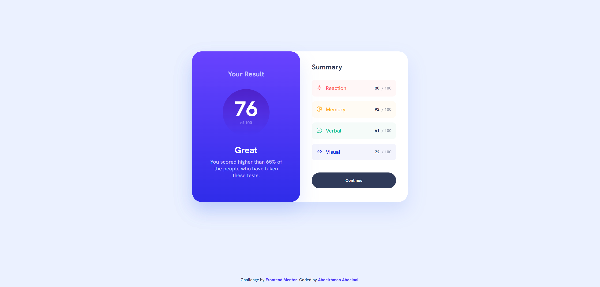

# Frontend Mentor - Product preview card component solution

This is a solution to the [Product preview card component challenge on Frontend Mentor](https://www.frontendmentor.io/challenges/product-preview-card-component-GO7UmttRfa). Frontend Mentor challenges help you improve your coding skills by building realistic projects.

## Table of contents

- [Overview](#overview)
  - [Screenshot](#screenshot)
  - [Links](#links)
- [My process](#my-process)
  - [Built with](#built-with)
  - [What I learned](#what-i-learned)
- [Author](#author)

## Overview

### Screenshot

### Links

- Solution URL: [GitHub](https://github.com/MrBlackvanta/product-preview-card-component-v2)
- Live Site URL: [Netlify](https://vanta-product-preview-card-component-v2.netlify.app)

## My process

### Built with

- React 19 + Vite 8
- TypeScript (strict mode)
- Tailwind CSS v4 — `@theme` for design tokens, `@utility` for typography presets (`text-preset-*`) and reusable component classes (`btn-primary`, `footer-link`)
- Path aliases via `baseUrl: "src"` + the `vite-tsconfig-paths` plugin for clean imports like `import { CartSVG } from "assets"`
- Mobile-first responsive layout — stacked on mobile, two-column at the `md` breakpoint
- `<picture>` + `<source>` for art-directed responsive hero image (mobile vs desktop variants)
- Semantic HTML: `<figure>` / `<figcaption>` for the product card, `<main>` / `<footer>` for page structure, proper heading hierarchy
- Custom SVG icon as a typed React component (`React.SVGProps<SVGSVGElement>`)
- Google Fonts (Montserrat + Fraunces) — URL trimmed to only the weights actually used

### What I learned

- **Vite asset imports vs string paths.** Referencing `/src/assets/...` as a plain string works in dev but 404s in production because Vite only fingerprints and bundles assets that are `import`ed. Importing the image modules is what lets Vite hash, bundle, and emit them into `dist/assets/`.
- **Tailwind v4 `@utility` for component classes.** The `@utility` directive composes multiple `@apply` rules into a single, reusable class — cleaner than repeating long className strings across JSX, while keeping all styles in the Tailwind layer.
- **Accessibility patterns for product cards:**
  - `<s>` + `aria-label="Original price"` for the struck-through price, so screen readers convey the discount semantics instead of reading two identical-sounding numbers.
  - `aria-hidden="true"` on decorative SVGs (the cart icon) to keep them out of the accessibility tree.
  - Descriptive `alt` text sourced from the data layer rather than duplicating the product title.
  - Visible `focus-visible` rings on every interactive element for keyboard users.
- **`Intl.NumberFormat` for currency.** Safer than `` `${price}` `` — it guarantees two-decimal output regardless of the raw number and localizes correctly if the app is ever translated.
- **LCP / CLS hygiene on hero images.** `fetchPriority="high"`, `decoding="async"`, and explicit `width` / `height` attributes tell the browser to prioritize the image download and reserve layout space so the card doesn't jump on first paint.
- **`prefers-reduced-motion`** handled globally in CSS, neutralizing transitions/animations for users who opt out at the OS level.
- **Path aliases need a runtime resolver.** TypeScript's `baseUrl` + `paths` only handle typechecking — Vite needs a plugin (`vite-tsconfig-paths`) to resolve the same aliases at build time.
- **Pixel-perfect vs. scale values.** Following the Figma spec (e.g. the button's `p-[17.5px]`) over forcing values into the default Tailwind spacing scale — arbitrary values are the right tool when the design calls for them.

## Author

- UpWork - [Abdelrhman Abdelaal](https://upwork.com/freelancers/~01f0a9479696b61f49)
- Frontend Mentor - [@MrBlackvanta](https://www.frontendmentor.io/profile/MrBlackvanta)
- LinkedIn - [@yourusername](https://www.linkedin.com/in/abdelrhman-vanta/)
